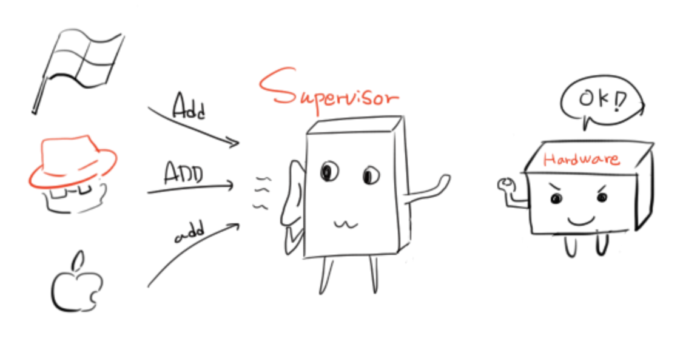
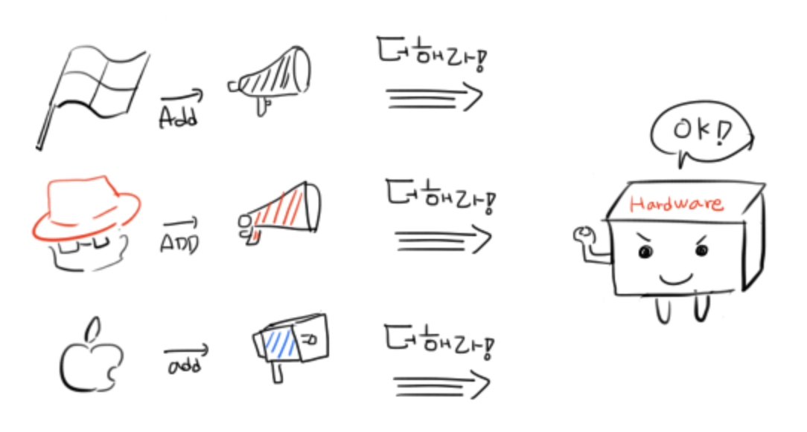
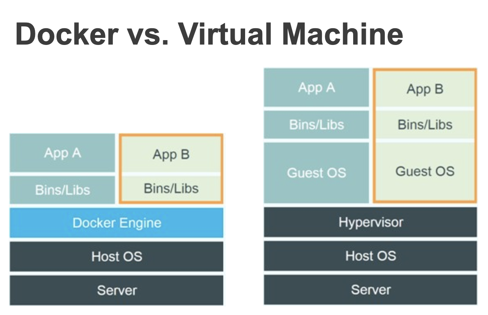

# 1. Docker

## ㅇ 2013년 3월 Docker, Inc (구 dotCloud)에서 출시한 오프 소스 컨테이너 프로젝트

## ㅇ 2010년 이후에 서버 시장이 급격하게 클라우드 환경 전환

- ### 서버 1~2대는 쉽게 서버 설정 가능. 그러나 서버 개수가 많아지면 관리하기 힘들어짐.

## ㅇ Immutable Infrastructure 패러다임 등장

- ### 호스트 OS(Ubuntu, Centos, Windows, OSX 등) 와 서비스 운영 환경(서버 프로그램, 소스 코드 등) 을 분리하고, 한 번 설정한 운영 환경은 (거의) 변경하지 않는 이미지 기반의 애플리케이션 배포 패러다임

- ### 장점

  - #### 편리한 관리

    - ##### 서비스 운영 환경을 이미지로 생성했으므로 이미지 자체만 관리하면 된다

    - ##### 이미지 생성 설정도 파일로 되어 있기 때문에 버전 관리 시스템을 활용

  - #### 확장

    - ##### 이미지 하나로 서버를 계속 생성

    - ##### 클라우드 플랫폼의 자동 확장 (Auto Scaling) 기능과 연동

  - #### 테스트

    - ##### 개발자의 PC나 테스트 서버에서 이미지를 실행하기만 하면 서비스 운영 환경과 동일한 환경

  - #### 가볍다

## ㅇ Docker는 가상 머신(VMware, Virtualbox 등)과 비슷하다.

- ### 가상 머신은 편하지만 성능이 좋지 못하다.

  - #### 전가상화

    

    

  - #### 반가상화

    

    

- ### 가상 머신 자체는 완전한 컴퓨터라 항상 게스트 OS를 설치

## ㅇ Docker는 하드웨어를 가상화하는 계층이 없기 때문에 메모리 접근, 파일시스템, 네트워크 속도가 가상 머신에 비해 월등히 빠르다.

