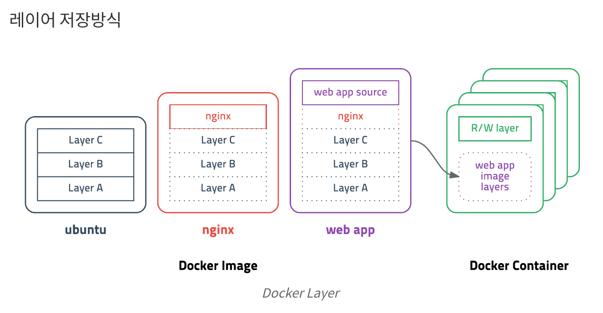

## 도커란 무엇인가??

- 컨테이너 기반 오픈소스 가상화 플랫폼

#### 컨테이너란?

> 다양한 프로그램, 실행환경을 컨테이너로 추상화하고 동일한 인터페이스를 제공하여 프로그램의 배포 및 관리를 단순하게 해줍니다.
>
> 백엔드 프로그램, 데이터베이스 서버, 메시지 큐등 **어떤 프로그램**도 컨테이너로 추상화할 수 있고 조립PC, AWS, Azure, Google cloud등 **어디에서든** 실행할 수 있습니다.

#### 가상화란?

> 가상화는 컴퓨터 하드웨어 시스템과 그 컴퓨터 상에서 돌고 있는 애플리케이션 사이에 **추상적인 층**을 추가하는 기술을 말한다. 
>
> 한 서버에서 **여러 운영체제**를 동시에 운영할 수 있도록 해주는 가상화 기술은 물리적이 아니라 논리적으로 컴퓨터 자원을 사용한다. 여러 대의 서버의 자원을 모아 하나의 리소스 풀로 통합한다고 생각하면 된다.


***기존의 가상화는...***

> 주로 OS를 가상화 하였다.
>
> 우리에게 익숙한 VMware나 VirtualBox같은 가상머신은 호스트 OS위에 게스트 OS 전체를 가상화하여 사용하는 방식입니다. 
>
> 이 방식은 여러가지 OS를 가상화(리눅스에서 윈도우를 돌린다던가) 할 수 있고 비교적 사용법이 간단하지만 **무겁고 느려서 운영환경에선 사용할 수 없었습니다.**
>
> 이후 **반가상화** 라는 것이 나왔습니다.


***그래서...***

> 추가적인 OS를 설치해야 한다는 점이 성능 문제가 되었고, 이를 개선하기 위해 **프로세스 격리** 하는 방식이 등장
>
> 리눅스에서는 이 방식을 **컨테이너**라 불렀다. 컨테이너는 CPU나 메모리를 프로세스가 필요한 만큼만 추가로 사용하고 성능적 손실도 거의 없었다.


### 컨테이너와 이미지

#### 이미지란?

> 컨테이너의 실행에 필요한 파일과 설정값들을 포함하고 있는 것
>
> **컨테이너** 는 이미지를 실행한 상태


#### 레이어 개념

> 도커 이미지는 컨테이너를 실행하기 위한 모든 정보를 가지고 있기 때문에 보통 용량이 수백메가MB에 이릅니다. 
>
> 처음 이미지를 다운받을 땐 크게 부담이 안되지만 기존 이미지에 파일 하나 추가했다고 수백메가를 다시 다운받는다면 매우 비효율적일 수 밖에 없습니다.
>
> 이 부분은 설명하기가 어렵기에 [여기](https://subicura.com/2017/01/19/docker-guide-for-beginners-1.html#section-4)를 보시면 됩니다 
>
> 


#### [DockerHub](https://hub.docker.com/)

> 이러한 이미지는 어떠한 설정 값이든 가지고 있을 수 있다. 이러한 **나만의 설정**들을 DockerHub에 등록하거나 Docker Registry 저장소를 만들어 관리할 수도 있다.

> 이미지는 url 방식으로 관리합니다. 
>
> 예를 들어 **ubuntu 14.04** 이미지는 ``docker.io/library/ubuntu:14.04`` 또는 ``docker.io/library/ubuntu:trusty`` 이고 ``docker.io/library`` 는 생략 가능 합니다. 
>
> 이러한 방식은 이해하기 쉽고 편리하게 사용할 수 있으며 태그 기능을 잘 이용하면 테스트나 롤백도 쉽게 할 수 있습니다.


#### Dockerfile

> 도커는 이미지를 만들기 위해 **Dockerfile** 이라는 파일에 자체 **DSL** 언어를 이용하여 이미지 생성 과정을 적습니다. 
>
> 서버에 어떤 프로그램을 설치하려고 이것저것 의존성 패키지를 설치하고 설정파일을 만들지 않아도 된다는 장점이 있습니다.


## 도커 본격적으로 사용해보기!

### 순서

1. 받고 싶은 이미지를 다운 받아보기
2. 이미지를 실행시켜 보기 (컨테이너로 변환)
3. 이미지 내에서 git 다운 받아보기
4. 컨테이너를 실행 상태로 놓고 나오기
5. 컨테이너를 종료하기 

## 1. 받고 싶은 이미지를 다운 받아보기

#### 이미지 목록을 보자

##### 명령어

``docker images``

> 현재 가지고 있는 이미지들을 나열해주는 명령어이다.
>
> 처음에는 기본으로 hello-world 라는 이미지가 설치되어있다.

> 도커에는 Git 처럼 push 와 pull 개념이 있다.

#### 우분투 이미지를 원격에서 받아보자

##### 명령어

`` docker pull ubuntu:14.04``

> 이 명령어를 치면 우분투 14.04 버전의 이미지가 설치가 된다
>
> ubutu 14.04 버전의 이미지가 목록에 추가 되었다.

#### 원격 DockerHub의 이미지를 검색하고 싶다면?

##### 명령어

``` docker search [이미지명]```

> 원격에 있는 ubuntu 와 연관이 있는 이미지 저장소를 나열해준다.
>
> 그냥 브라우저로 찾는게 나을수도.....(~~너무 목록이 많이 나옴...~~)

## 2. 이미지를 실행시켜 보기 (컨테이너로 변환)

#### 기본 실행

##### 명령어

``docker run [이미지명:버전]``

#### 우분투 내로 들어가려면?

##### 명령어

``docker run -i -t ubuntu:14.04 /bin/bash``

> -i 와 -t 옵션을 주면 터미널을 띄울 수 있고 /bin/bash 를 커맨드로 입력하여 bash 쉘을 실행할 수 있다.

``docker run -d --name [정하고 싶은 이름] [이미지 명]``

> -d 옵션은 백그라운드로 detach 로 돌리는 것 --name 옵션을 주어 컨테이너에 이름을 정할 수 있다.

#### 컨테이너 Name 으로 실행하기

##### 명령어

``docker start [컨테이너 Name]``

> 도커에서는 처음 ``docker run`` 할때 컨테이너 Name을 지정하거나 지정하지 않는 경우 자동으로 설정해준다. 
>
> 이때 지정된 컨테이너 Name 으로 컨테이너를 실행 할 수 있다. 또한 컨테이너 ID 로도 실행 할 수 있다.


#### docker run VS docker start

> ``run`` 명령어는 실행과 동시에 접속하는것
>
> ``start`` 명령어는 그냥 실행만 하는 것
>
> ``attach`` 명령어는 컨테이너 내부로 들어가는 것
>
> run = start + attach

## 3. 컨테이너 내에서 git 다운 받아보기

> 우분투 내로 들어간 터미널에서 ``apt-get install git`` 명령어를 치면 된다.


## + 컨테이너의 상태를 알아보기

##### 명령어

``docker ps``

> 이 명령어를 치면 현재 실행되고 있는 컨테이너의 목록을 볼 수 있다.

``docker ps -a``

> 이 명령어를 치면 현재 실행되고 있는 컨테이너의 목록과 종료된 컨테이너 목록 둘 다 볼 수 있다.


## 4. 컨테이너를 실행 상태로 놓고 나오기

> 컨테이너의 터미널 상태에서 ``ctrl + p + q`` (bash 의 단축키) 를 치면 컨테이너를 실행 상태로 두고 나올 수 있다.

## 5. 컨테이너를 종료하기 

#### 우분투 내에서 종료하기

> 우분투 내 터미널에서 ``exit`` 명령어를 치면 bash 쉘이 종료 되면서 컨테이너가 종료된다.

#### 우분투 바깥에서 종료하기

##### 명령어

``docker stop [컨테이너 이름 or id]``


## + 완전히 삭제하기

> 도커는 컨테이너를 종료하더라도 형태를 남겨 놓는다 (언제든지 다시 쓸 수 있게)
>
> 이러한 형태 조차도 지우고 싶을 수 있다.

##### 명령어

``docker rm [컨테이너 이름 or id]``

> 이미지를 삭제하고 싶다면?

##### 명령어

``docker rmi [이미지 이름]``


