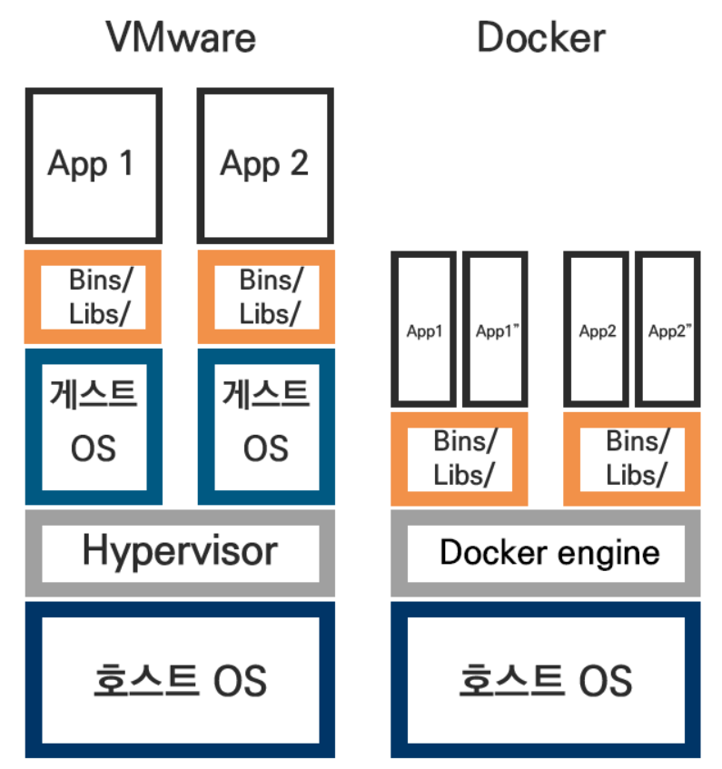
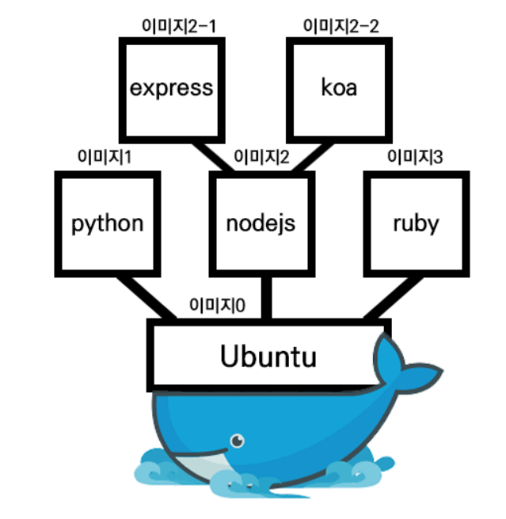

# 도커(Docker)란?

도커(Docker)는 전세계적으로 사용되고있는 컨테이너 가상화 플랫폼이다. 

가상머신: 호스트OS 위에 게스트OS를 설치해서 동작

도커: 도커엔진 위에 시스템운영에 필요한 최소한의 라이브러리들만 설치하고 시스템자원은 호스트OS와 공유

=======
---------

도커에는 이미지와 컨테이너라는 개념이 있다. 이미지를 통해서 컨테이너를 찍어낸다. 이미지만 있다면 같은 컨테이너를 몇개라도 만들 수 있다.

도커는 레이어를 겹치는것처럼 컨테이너의 이미지를 겹치는 방식으로 동작한다. 따라서 하나의 이미지에서 파생된 여러가지 이미지를 만들 수 있다.
또한 같은 이미지를 사용한다면 이미지의 용량을 아낄 수 있다.

또한 도커가 유명해진 가장 큰 이유 중 하나는 이렇게 제작한 이미지를 Docker Hub에 쉽게 공유할 수 있다는 점이다.
마치 Github처럼 자유로운 pull/push가 가능하다.

